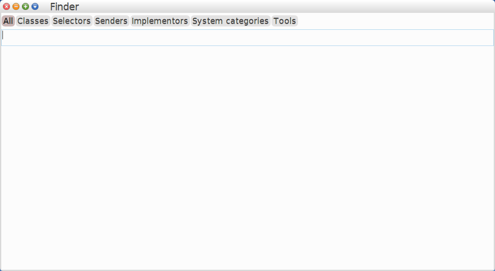
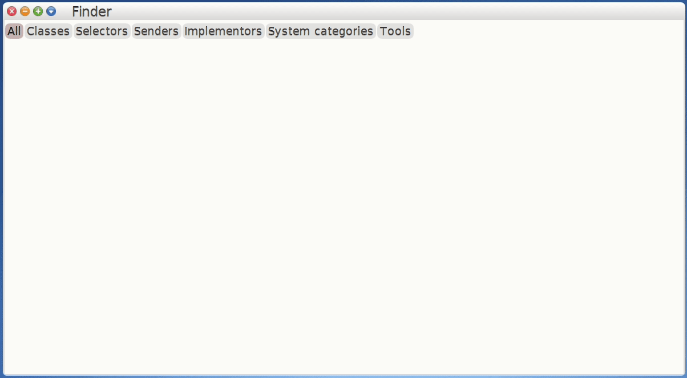
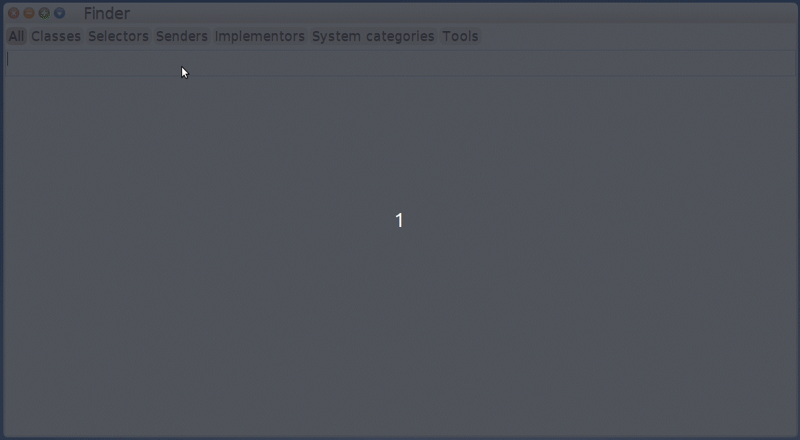
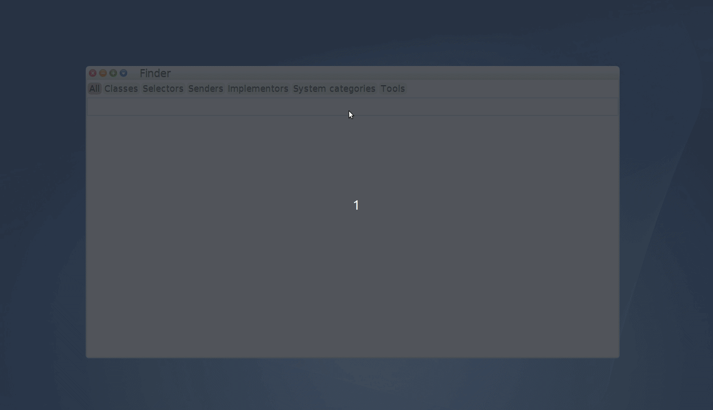

# Cuis Finder

## Description

Finder is a system-wide search tool for [Cuis Smalltalk](https://github.com/Cuis-Smalltalk/Cuis-Smalltalk-Dev).

You can use it to search for classes, methods, senders, implementors, system categories... you name it!

It is inspired by Pharo's Spotter and the search feature provided by JetBrains tools, such as IntelliJ IDEA. 

## Feedback
Finder is in its early stages, so all feedback is welcomed!

Feel free to [submit an issue](https://github.com/npapagna/cuis-finder/issues) to report bugs, improvements, etc.

## Installing

Install the `Tools-Finder.pck.st` package in this repository by dragging and dropping it into your Cuis image, and you'll be good to go.

## Usage Instructions

## Opening
Press `shift + enter` to open Finder:

The main window displays the **catalogs** that are available for searching (top), the **search bar** to enter queries (below the catalogs) and the **results** pane.

### Closing
Press `esc` while the search bar has focus to close Finder.

### Searching
Enter a query in the search bar to see results as you type:

### Catalog Navigation
You can scroll through the catalogs to narrow your search by pressing:
 
 * `tab` to select the next catalog
 * `shift + tab` to select the previous catalog
 
 while the search bar has focus.
 

### Results Navigation
You can scroll through the results either by pressing:
* `up` and `down` arrows
* `enter` to browse the selected result

